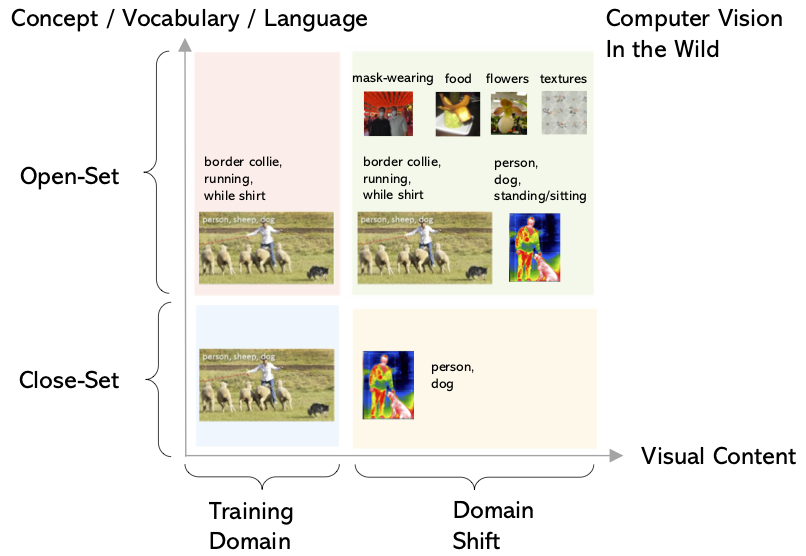
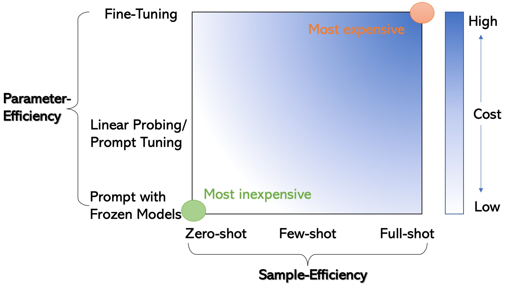

# CVinW Readings [](https://github.com/Computer-Vision-in-the-Wild/CVinW_Readings)

``[Computer Vision in the Wild (CVinW)](https://computer-vision-in-the-wild.github.io/eccv-2022/)'' is an emerging research field. This writeup provides a quick introduction of CVinW and maintains a collection of papers on the topic. If you find some missing papers or resourses, please open issues or pull requests (recommended).


# Table of Contents

- [What is Computer Vision in the Wild (CVinW)?](#what-is-computer-vision-in-the-wild)
  - [Goals of CVinW](#star-goals-of-cvinw)
  - [Task Transfer Scenarios are Broad](#one-task-transfer-scenarios-are-broad) 
  - [Task Transfer Cost is Low](#two-task-transfer-cost-is-low )
  - [Benchmarks](#cinema-benchmarks)
  - [News](#loudspeaker-news)
- [Papers on Task-level Transfer with Pre-trained Models](#fire-papers-on-task-level-transfer-with-pre-trained-models)
  - [Image Classification in the Wild](#orange_book-image-classification-in-the-wild)
  - [Object Detection in the Wild](#orange_book-object-detection-in-the-wild)
  - [Segmentation in the Wild](#orange_book-segmentation-in-the-wild)
  - [Video Classification in the Wild](#orange_book-video-classification-in-the-wild)
  - [Others](#orange_book-other-visual-recognition-in-the-wild)
- [Papers on Efficient Model Adaptation](#snowflake-papers-on-efficient-model-adaptation)  
  - [Parameter-Efficient Methods](#blue_book-parameter-efficient-methods)
  - [Others](#blue_book-other-efficient-model-adaptation-methods)
- [Papers on Out-of-domain Generalization](#eye-papers-on-out-of-domain-generalization)
  - [Surveys](#green_book-surveys)
  - [Out-of-domain Generalization](#green_book-out-of-domain-generalization)
  - [Robust Models](#green_book-robust-models)
- [Acknowledgements](#beers-acknowledgements)


# What is Computer Vision in the Wild?

### :star: Goals of CVinW
Developing a transferable foundation model/system that can *effortlessly* adapt to *a large range of visual tasks* in the wild. It comes with two key factors: (i) The task transfer scenarios are broad, and (ii) The task transfer cost is low. The main idea is illustrated as follows, please see the detailed description in [ELEVATER paper](https://arxiv.org/abs/2204.08790). 

### :one: Task Transfer Scenarios are Broad

We illustrate and compare CVinW with other settings using a 2D chart in Figure 1, where the space is constructed with two orthogonal dimensions:
input image distribution and output concept set. The 2D chart is divided into four quadrants, based on how the model evaluation stage is different from model development stage. For any visual recognition problems at different granularity such as image classification, object detection and segmentation, the modeling setup cann be categorized into one of the four settings. We see an emerging trend on moving towards CVinW. Interested in the various pre-trained vision models that move towards CVinW? please check out Section :fire:[``Papers on Task-level Transfer with Pre-trained Models''](#fire-papers-on-task-level-transfer-with-pre-trained-models).

<table>
<tr>
  <td  width="50%">
<ul>
  <li><b>The Close-Set Setting. </b> Both training and evaluation distributions are consistent in both dimensions, a typical setting in ML/CV textbooks.</li>
  <li><b>Open-Set/Vocabulary/World Setting.</b> It allows new concepts in evaluation, while typically remains the same visual domain. Please see examples in <a href='https://arxiv.org/abs/1707.00600'>image classification</a>  and <a href='https://arxiv.org/abs/2011.10678'>object detection</a>. </li>
  <li><b>Domain Generalization Setting.</b> Domain shift allows new visual domain in evaluation, while typically remains the same concept pool. Please see examples such as <a href='https://arxiv.org/abs/2007.01434'>DomainBed</a>  and <a href='http://ai.bu.edu/M3SDA/'>DomainNet</a>.  </li>
  <li style="background-color:powderblue;"><b>Computer Vision in the Wild Setting. </b> CVinW allows the flexibility in both dimensions, where any new tasks/datasets in the wild essentially fall into.</li>
</ul>    

</td>
<td>
     
</td>
</tr> 
<tr>
  <th> A brief definition with a four-quadrant chart </th>
  <th>Figure 1: The comparison of CVinW with other existing settings</th>
</tr>
</table>


### :two: Task Transfer Cost is Low

One major advantage of pre-trained models is the promise that they can transfer to downstream tasks *effortlessly*. The model adaptation cost is considered in two orthogonal dimensions: *sample-efficiency* and *parameter-efficiency*, as illustrated in Figure 2.  The bottom-left corner and  top-right corner is the most inexpensive and  expensive adaptation strategy, respectively. One may interpolate and  make combinations in the 2D space, to get different model adaptation methods with different cost. To efficient adapt large vision models of the gradaully increaseing size, we see an emerging need on efficient model adaptation. Interested in contributing your smart efficient adaptation algorithms and see how it differs from existing papers? please check out Section :snowflake:[``Papers on Efficient Model Adaptation''](#snowflake-papers-on-efficient-model-adaptation)  .

<table>
<tr>
  <td  width="50%">
<ul>
  <li><b>Sample-efficiency: Zero-, Few-, and Full-shot. </b> Due to the high cost of annotating data, it is often desired to provide a small number of labeled image-label pairs in downstream datasets. Transferable models should be able to reach high performance in this data-limited scenario..</li>
  <li><b>Parameter-efficiency: Frozen Model Inference, Prompting Tuning, Linear Probing vs Full Model Fine-tuning..</b> A smaller number of trainable parameter in model adaptation typically means a small training cost in a new task. </li>
</ul>    

</td>
<td>
    
</td>
</tr> 
<tr>
  <th> A breakdown definition of efficient model adaptation</th>
  <th>Figure 2: The 2D chart of model adaptation cost.</th>
</tr>
</table>

 
###  :cinema: Benchmarks

<p>
<font size=3><b>ELEVATER: A Benchmark and Toolkit for Evaluating Language-Augmented Visual Models.</b></font>
<br>
<font size=2>Chunyuan Li*, Haotian Liu*, Liunian Harold Li, Pengchuan Zhang, Jyoti Aneja, Jianwei Yang, Ping Jin, Houdong Hu, Zicheng Liu, Yong Jae Lee, Jianfeng Gao.</font>
<br>
<font size=2> NeurIPS 2022 (Datasets and Benchmarks Track).</font>
<a href='https://arxiv.org/abs/2204.08790'>[paper]</a> <a href='https://computer-vision-in-the-wild.github.io/ELEVATER/'>[benchmark]</a>    
</p>

###  :loudspeaker: News

* [09/2022] Organizing ECCV Workshop [*Computer Vision in the Wild (CVinW)*](https://computer-vision-in-the-wild.github.io/eccv-2022/), where two challenges are hosted to evaluate the zero-shot, few-shot and full-shot performance of pre-trained vision models in downstream tasks:
  - [``*Image Classification in the Wild (ICinW)*''](https://eval.ai/web/challenges/challenge-page/1832/overview) Challenge evaluates on 20 image classification tasks.
  - [``*Object Detection in the Wild (ODinW)*''](https://eval.ai/web/challenges/challenge-page/1839/overview) Challenge evaluates on 35 object detection tasks.

$\qquad$ [  [Workshop]](https://computer-vision-in-the-wild.github.io/eccv-2022/)    $\qquad$    [ [IC Challenge] ](https://eval.ai/web/challenges/challenge-page/1832/overview)
$\qquad$    [ [OD Challenge] ](https://eval.ai/web/challenges/challenge-page/1839/overview)


# :fire: Papers on Task-level Transfer with Pre-trained Models

## :orange_book: Image Classification in the Wild

<p>
<font size=3><b>[CLIP] Learning Transferable Visual Models From Natural Language Supervision.</b></font>
<br>
<font size=2>Alec Radford, Jong Wook Kim, Chris Hallacy, Aditya Ramesh, Gabriel Goh, Sandhini Agarwal, Girish Sastry, Amanda Askell, Pamela Mishkin, Jack Clark, Gretchen Krueger, Ilya Sutskever.</font>
<br>
<font size=2>ICML 2021.</font>
<a href='https://arxiv.org/abs/2103.00020'>[paper]</a> <a href='https://github.com/OpenAI/CLIP'>[code]</a>    
</p>

<p>
<font size=3><b>[ALIGN] Scaling Up Visual and Vision-Language Representation Learning With Noisy Text Supervision.</b></font>
<br>
<font size=2>Chao Jia, Yinfei Yang, Ye Xia, Yi-Ting Chen, Zarana Parekh, Hieu Pham, Quoc V. Le, Yunhsuan Sung, Zhen Li, Tom Duerig.</font>
<br>
<font size=2>ICML 2021.</font>
<a href='https://arxiv.org/abs/2102.05918'>[paper]</a> 
</p>

<p>
<font size=3><b>OpenCLIP.</b></font>
<br>
<font size=2>Gabriel Ilharco*, Mitchell Wortsman*, Nicholas Carlini, Rohan Taori, Achal Dave, Vaishaal Shankar, John Miller, Hongseok Namkoong, Hannaneh Hajishirzi, Ali Farhadi, Ludwig Schmidt.</font>
<br>
<font size=2>10.5281/zenodo.5143773, 2021.</font>
<a href='https://github.com/mlfoundations/open_clip'>[code]</a>   
</p>

<p>
<font size=3><b>Florence: A New Foundation Model for Computer Vision.</b></font>
<br>
<font size=2>Lu Yuan, Dongdong Chen, Yi-Ling Chen, Noel Codella, Xiyang Dai, Jianfeng Gao, Houdong Hu, Xuedong Huang, Boxin Li, Chunyuan Li, Ce Liu, Mengchen Liu, Zicheng Liu, Yumao Lu, Yu Shi, Lijuan Wang, Jianfeng Wang, Bin Xiao, Zhen Xiao, Jianwei Yang, Michael Zeng, Luowei Zhou, Pengchuan Zhang.</font>
<br>
<font size=2>	arXiv:2111.11432, 2022.</font>
<a href='https://arxiv.org/abs/2111.11432'>[paper]</a>
</p>


<p>
<font size=3><b>[UniCL] Unified Contrastive Learning in Image-Text-Label Space.</b></font>
<br>
<font size=2>Jianwei Yang*, Chunyuan Li*, Pengchuan Zhang*, Bin Xiao*, Ce Liu, Lu Yuan, Jianfeng Gao.</font>
<br>
<font size=2>CVPR 2022.</font>
<a href='https://arxiv.org/abs/2204.03610'>[paper]</a>  <a href='https://github.com/microsoft/UniCL'>[code]</a>   
</p>

<p>
<font size=3><b>LiT: Zero-Shot Transfer with Locked-image text Tuning.</b></font>
<br>
<font size=2>Xiaohua Zhai, Xiao Wang, Basil Mustafa, Andreas Steiner, Daniel Keysers, Alexander Kolesnikov, Lucas Beyer.</font>
<br>
<font size=2>CVPR 2022.</font>
<a href='https://arxiv.org/abs/2111.07991'>[paper]</a>
</p>

<p>
<font size=3><b>[DeCLIP] Supervision Exists Everywhere: A Data Efficient Contrastive Language-Image Pre-training Paradigm.</b></font>
<br>
<font size=2>Yangguang Li, Feng Liang, Lichen Zhao, Yufeng Cui, Wanli Ouyang, Jing Shao, Fengwei Yu, Junjie Yan.</font>
<br>
<font size=2>ICLR 2022.</font>
<a href='https://arxiv.org/abs/2110.05208'>[paper]</a>  <a href='https://github.com/Sense-GVT/DeCLIP'>[code]</a>   
</p>

<p>
<font size=3><b>FILIP: Fine-grained Interactive Language-Image Pre-Training.</b></font>
<br>
<font size=2>Lewei Yao, Runhui Huang, Lu Hou, Guansong Lu, Minzhe Niu, Hang Xu, Xiaodan Liang, Zhenguo Li, Xin Jiang, Chunjing Xu.</font>
<br>
<font size=2>ICLR 2022.</font>
<a href='https://arxiv.org/abs/2111.07783'>[paper]</a> 
</p>

<p>
<font size=3><b>SLIP: Self-supervision meets Language-Image Pre-training.</b></font>
<br>
<font size=2>Norman Mu, Alexander Kirillov, David Wagner, Saining Xie.</font>
<br>
<font size=2>ECCV 2022.</font>
<a href='https://arxiv.org/abs/2112.12750'>[paper]</a>  <a href='https://github.com/facebookresearch/SLIP'>[code]</a>   
</p>

<p>
<font size=3><b>[MS-CLIP]: Learning Visual Representation from Modality-Shared Contrastive Language-Image Pre-training.</b></font>
<br>
<font size=2>Haoxuan You*, Luowei Zhou*, Bin Xiao*, Noel Codella*, Yu Cheng, Ruochen Xu, Shih-Fu Chang, Lu Yuan.</font>
<br>
<font size=2>ECCV 2022.</font>
<a href='https://arxiv.org/abs/2207.12661'>[paper]</a>  <a href='https://github.com/Hxyou/MSCLIP'>[code]</a>   
</p>


<p>
<font size=3><b>MultiMAE: Multi-modal Multi-task Masked Autoencoders.</b></font>
<br>
<font size=2>Roman Bachmann, David Mizrahi, Andrei Atanov, Amir Zamir.</font>
<br>
<font size=2>ECCV 2022.</font>
<a href='https://arxiv.org/abs/2204.01678'>[paper]</a>  <a href='https://github.com/EPFL-VILAB/MultiMAE'>[code]</a>  <a href='https://multimae.epfl.ch/'>[project]</a>
</p>

<p>
<font size=3><b>[M3AE] Multimodal Masked Autoencoders Learn Transferable Representations.</b></font>
<br>
<font size=2>Xinyang Geng, Hao Liu, Lisa Lee, Dale Schuurmans, Sergey Levine, Pieter Abbeel.</font>
<br>
<font size=2>	arXiv:2205.14204, 2022.</font>
<a href='https://arxiv.org/abs/2205.14204'>[paper]</a>  <a href='https://github.com/young-geng/m3ae_public'>[code]</a>
</p>


<p>
<font size=3><b>CyCLIP: Cyclic Contrastive Language-Image Pretraining.</b></font>
<br>
<font size=2>Shashank Goel, Hritik Bansal, Sumit Bhatia, Ryan A. Rossi, Vishwa Vinay, Aditya Grover.</font>
<br>
<font size=2>NeurIPS 2022.</font>
<a href='https://arxiv.org/abs/2205.14459'>[paper]</a>  <a href='https://github.com/goel-shashank/CyCLIP'>[code]</a>   
</p>

<p>
<font size=3><b>PyramidCLIP: Hierarchical Feature Alignment for Vision-language Model Pretraining.</b></font>
<br>
<font size=2>Yuting Gao, Jinfeng Liu, Zihan Xu, Jun Zhang, Ke Li, Rongrong Ji, Chunhua Shen.</font>
<br>
<font size=2>NeurIPS 2022.</font>
<a href='https://arxiv.org/abs/2204.14095'>[paper]</a> 
</p>

<p>
<font size=3><b>K-LITE: Learning Transferable Visual Models with External Knowledge.</b></font>
<br>
<font size=2>Sheng Shen*, Chunyuan Li*, Xiaowei Hu*, Yujia Xie, Jianwei Yang, Pengchuan Zhang, Anna Rohrbach, Zhe Gan, Lijuan Wang, Lu Yuan, Ce Liu, Kurt Keutzer, Trevor Darrell, Jianfeng Gao.</font>
<br>
<font size=2>NeurIPS 2022.</font>
<a href='https://arxiv.org/abs/2204.09222'>[paper]</a> 
</p>


<p>
<font size=3><b>UniCLIP: Unified Framework for Contrastive Language-Image Pre-training.</b></font>
<br>
<font size=2>Janghyeon Lee, Jongsuk Kim, Hyounguk Shon, Bumsoo Kim, Seung Hwan Kim, Honglak Lee, Junmo Kim.</font>
<br>
<font size=2>NeurIPS 2022.</font>
<a href='https://arxiv.org/abs/2209.13430'>[paper]</a> 
</p>

<p>
<font size=3><b>CoCa: Contrastive Captioners are Image-Text Foundation Models.</b></font>
<br>
<font size=2>Jiahui Yu, Zirui Wang, Vijay Vasudevan, Legg Yeung, Mojtaba Seyedhosseini, Yonghui Wu.</font>
<br>
<font size=2>	arXiv:2205.01917, 2022.</font>
<a href='https://arxiv.org/abs/2205.01917'>[paper]</a> 
</p>

<p>
<font size=3><b>Prefix Conditioning Unifies Language and Label Supervision.</b></font>
<br>
<font size=2>Kuniaki Saito, Kihyuk Sohn, Xiang Zhang, Chun-Liang Li, Chen-Yu Lee, Kate Saenko, Tomas Pfister.</font>
<br>
<font size=2>arXiv:2206.01125, 2022.</font>
<a href='https://arxiv.org/abs/2206.01125'>[paper]</a> 
</p>

<p>
<font size=3><b>MaskCLIP: Masked Self-Distillation Advances Contrastive Language-Image Pretraining.</b></font>
<br>
<font size=2>Xiaoyi Dong, Yinglin Zheng, Jianmin Bao, Ting Zhang, Dongdong Chen, Hao Yang, Ming Zeng, Weiming Zhang, Lu Yuan, Dong Chen, Fang Wen, Nenghai Yu.</font>
<br>
<font size=2>arXiv:2208.12262, 2021</font>
<a href='https://arxiv.org/abs/2208.12262'>[paper]</a>
</p>

<p>
<font size=3><b>[BASIC] Combined Scaling for Open-Vocabulary Image Classification.</b></font>
<br>
<font size=2>Hieu Pham, Zihang Dai, Golnaz Ghiasi, Kenji Kawaguchi, Hanxiao Liu, Adams Wei Yu, Jiahui Yu, Yi-Ting Chen, Minh-Thang Luong, Yonghui Wu, Mingxing Tan, Quoc V. Le.</font>
<br>
<font size=2>	arXiv:2111.10050, 2022.</font>
<a href='https://arxiv.org/abs/2111.10050'>[paper]</a> 
</p>

<p>
<font size=3><b>[LIMoE] Multimodal Contrastive Learning with LIMoE: the Language-Image Mixture of Experts.</b></font>
<br>
<font size=2>Basil Mustafa, Carlos Riquelme, Joan Puigcerver, Rodolphe Jenatton, Neil Houlsby.</font>
<br>
<font size=2>	arXiv:2206.02770, 2022.</font>
<a href='https://arxiv.org/abs/2206.02770'>[paper]</a> 
</p>


<p>
<font size=3><b>MURAL: Multimodal, Multitask Retrieval Across Languages.</b></font>
<br>
<font size=2>Aashi Jain, Mandy Guo, Krishna Srinivasan, Ting Chen, Sneha Kudugunta, Chao Jia, Yinfei Yang, Jason Baldridge.</font>
<br>
<font size=2>arXiv:2109.05125, 2022.</font>
<a href='https://arxiv.org/abs/2109.05125'>[paper]</a> 
</p>


<p>
<font size=3><b>PaLI: A Jointly-Scaled Multilingual Language-Image Model.</b></font>
<br>
<font size=2>Xi Chen, Xiao Wang, Soravit Changpinyo, AJ Piergiovanni, Piotr Padlewski, Daniel Salz, Sebastian Goodman, Adam Grycner, Basil Mustafa, Lucas Beyer, Alexander Kolesnikov, Joan Puigcerver, Nan Ding, Keran Rong, Hassan Akbari, Gaurav Mishra, Linting Xue, Ashish Thapliyal, James Bradbury, Weicheng Kuo, Mojtaba Seyedhosseini, Chao Jia, Burcu Karagol Ayan, Carlos Riquelme, Andreas Steiner, Anelia Angelova, Xiaohua Zhai, Neil Houlsby, Radu Soricut.</font>
<br>
<font size=2>	arXiv:2209.06794, 2022.</font>
<a href='https://arxiv.org/abs/2209.06794'>[paper]</a> 
</p>


## :orange_book: Object Detection in the Wild

<p>
<font size=3><b>Open-Vocabulary Object Detection Using Captions.</b></font>
<br>
<font size=2>Alireza Zareian, Kevin Dela Rosa, Derek Hao Hu, Shih-Fu Chang.</font>
<br>
<font size=2>CVPR 2021.</font>
<a href='https://arxiv.org/abs/2011.10678'>[paper]</a> 
</p>

<p>
<font size=3><b>MDETR: Modulated Detection for End-to-End Multi-Modal Understanding.</b></font>
<br>
<font size=2>Aishwarya Kamath, Mannat Singh, Yann LeCun, Gabriel Synnaeve, Ishan Misra, Nicolas Carion.</font>
<br>
<font size=2>ICCV 2021.</font>
<a href='https://arxiv.org/abs/2104.12763'>[paper]</a> <a href='https://github.com/ashkamath/mdetr'>[code]</a>    
</p>

<p>
<font size=3><b>[VILD] 
Open-vocabulary Object Detection via Vision and Language Knowledge Distillation.
</b></font>
<br>
<font size=2>Xiuye Gu, Tsung-Yi Lin, Weicheng Kuo, Yin Cui.</font>
<br>
<font size=2>ICLR 2022.</font>
<a href='https://arxiv.org/abs/2104.13921'>[paper]</a>
</p>


<p>
<font size=3><b>[GLIP] Grounded Language-Image Pre-training.</b></font>
<br>
<font size=2>Liunian Harold Li*, Pengchuan Zhang*, Haotian Zhang*, Jianwei Yang, Chunyuan Li, Yiwu Zhong, Lijuan Wang, Lu Yuan, Lei Zhang, Jenq-Neng Hwang, Kai-Wei Chang, Jianfeng Gao</font>
<br>
<font size=2>CVPR 2022.</font>
<a href='https://arxiv.org/abs/2112.03857'>[paper]</a> <a href='https://github.com/microsoft/GLIP'>[code]</a>    
</p>

<p>
<font size=3><b>RegionCLIP: Region-based Language-Image Pretraining.</b></font>
<br>
<font size=2>Yiwu Zhong, Jianwei Yang, Pengchuan Zhang, Chunyuan Li, Noel Codella, Liunian Harold Li, Luowei Zhou, Xiyang Dai, Lu Yuan, Yin Li, Jianfeng Gao.</font>
<br>
<font size=2>CVPR 2022.</font>
<a href='https://arxiv.org/abs/2112.09106'>[paper]</a> <a href='https://github.com/microsoft/RegionCLIP'>[code]</a>    
</p>


<p>
<font size=3><b>[OV-DETR] Open-Vocabulary DETR with Conditional Matching Yuhang.</b></font>
<br>
<font size=2>Yuhang Zang, Wei Li, Kaiyang Zhou, Chen Huang, Chen Change Loy.</font>
<br>
<font size=2>ECCV 2022.</font>
<a href='https://arxiv.org/abs/2203.11876'>[paper]</a> <a href='https://github.com/yuhangzang/ov-detr'>[code]</a>    
</p>


<p>
<font size=3><b>[OWL-ViT] Simple Open-Vocabulary Object Detection with Vision Transformers.</b></font>
<br>
<font size=2>Matthias Minderer, Alexey Gritsenko, Austin Stone, Maxim Neumann, Dirk Weissenborn, Alexey Dosovitskiy, Aravindh Mahendran, Anurag Arnab, Mostafa Dehghani, Zhuoran Shen, Xiao Wang, Xiaohua Zhai, Thomas Kipf, Neil Houlsby.</font>
<br>
<font size=2>ECCV 2022.</font>
<a href='https://arxiv.org/abs/2205.06230'>[paper]</a>     
</p>


<p>
<font size=3><b>[Detic] Detecting Twenty-thousand Classes using Image-level Supervision.</b></font>
<br>
<font size=2>Xingyi Zhou, Rohit Girdhar, Armand Joulin, Philipp Krähenbühl, Ishan Misra.</font>
<br>
<font size=2>ECCV 2022.</font>
<a href='https://arxiv.org/abs/2201.02605'>[paper]</a> <a href='https://github.com/facebookresearch/Detic/'>[code]</a>        
</p>


<p>
<font size=3><b>X-DETR: A Versatile Architecture for Instance-wise Vision-Language Tasks.</b></font>
<br>
<font size=2>Zhaowei Cai, Gukyeong Kwon, Avinash Ravichandran, Erhan Bas, Zhuowen Tu, Rahul Bhotika, Stefano Soatto.</font>
<br>
<font size=2>ECCV 2022.</font>
<a href='https://arxiv.org/abs/2204.05626'>[paper]</a>     
</p>

<p>
<font size=3><b>FindIt: Generalized Localization with Natural Language Queries.</b></font>
<br>
<font size=2>Weicheng Kuo, Fred Bertsch, Wei Li, AJ Piergiovanni, Mohammad Saffar, Anelia Angelova.</font>
<br>
<font size=2>ECCV 2022.</font>
<a href='https://arxiv.org/abs/2203.17273'>[paper]</a>     
</p>


<p>
<font size=3><b>Open Vocabulary Object Detection with Pseudo Bounding-Box Labels.</b></font>
<br>
<font size=2>Mingfei Gao, Chen Xing, Juan Carlos Niebles, Junnan Li, Ran Xu, Wenhao Liu, Caiming Xiong.</font>
<br>
<font size=2>ECCV 2022.</font>
<a href='https://arxiv.org/abs/2111.09452'>[paper]</a> <a href='https://github.com/salesforce/PB-OVD'>[code]</a>    <a href='https://blog.salesforceairesearch.com/pb-ovd-open-vocabulary-object-detector/'>[blog]</a>        
</p>


<p>
<font size=3><b>PromptDet: Towards Open-vocabulary Detection using Uncurated Images.</b></font>
<br>
<font size=2>Chengjian Feng, Yujie Zhong, Zequn Jie, Xiangxiang Chu, Haibing Ren, Xiaolin Wei, Weidi Xie, Lin Ma.</font>
<br>
<font size=2>ECCV 2022.</font>
<a href='https://arxiv.org/abs/2203.16513'>[paper]</a> <a href='https://fcjian.github.io/promptdet/'>[code]</a>        
</p>

<p>
<font size=3><b>Class-agnostic Object Detection with Multi-modal Transformer.</b></font>
<br>
<font size=2>Muhammad Maaz, Hanoona Rasheed, Salman Khan, Fahad Shahbaz Khan, Rao Muhammad Anwer and Ming-Hsuan Yang.</font>
<br>
<font size=2>ECCV 2022.</font>
<a href='https://arxiv.org/abs/2111.11430'>[paper]</a> <a href='https://github.com/mmaaz60/mvits_for_class_agnostic_od'>[code]</a>    
</p>

<p>
<font size=3><b>[Object Centric OVD] -- Bridging the Gap between Object and Image-level Representations for Open-Vocabulary Detection.</b></font>
<br>
<font size=2>Hanoona Rasheed, Muhammad Maaz, Muhammad Uzair Khattak, Salman Khan, Fahad Shahbaz Khan.</font>
<br>
<font size=2>NeurIPS 2022</font>
<a href='https://arxiv.org/abs/2207.03482'>[paper]</a> <a href='https://github.com/hanoonaR/object-centric-ovd'>[code]</a>    
</p>

<p>
<font size=3><b>[GLIPv2] Unifying Localization and Vision-Language Understanding.</b></font>
<br>
<font size=2>Haotian Zhang*, Pengchuan Zhang*, Xiaowei Hu, Yen-Chun Chen, Liunian Harold Li, Xiyang Dai, Lijuan Wang, Lu Yuan, Jenq-Neng Hwang, Jianfeng Gao.</font>
<br>
<font size=2>NeurIPS 2022</font>
<a href='https://arxiv.org/abs/2206.05836'>[paper]</a> <a href='https://github.com/microsoft/GLIP'>[code]</a>    
</p>

<p>
<font size=3><b>[FIBER] Coarse-to-Fine Vision-Language Pre-training with Fusion in the Backbone.</b></font>
<br>
<font size=2>Zi-Yi Dou, Aishwarya Kamath, Zhe Gan, Pengchuan Zhang, Jianfeng Wang, Linjie Li, Zicheng Liu, Ce Liu, Yann LeCun, Nanyun Peng, Jianfeng Gao, Lijuan Wang.</font>
<br>
<font size=2>NeurIPS 2022</font>
<a href='https://arxiv.org/abs/2206.07643'>[paper]</a> <a href='https://github.com/microsoft/FIBER'>[code]</a>    
</p>

<p>
<font size=3><b>[DetCLIP] Dictionary-Enriched Visual-Concept Paralleled Pre-training for Open-world Detection.</b></font>
<br>
<font size=2> Lewei Yao, Jianhua Han, Youpeng Wen, Xiaodan Liang, Dan Xu, Wei zhang, Zhenguo Li, Chunjing Xu, Hang Xu.</font>
<br>
<font size=2>NeurIPS 2022</font>
<a href='https://arxiv.org/abs/2209.09407v1'>[paper]</a>  
</p>

<p>
<font size=3><b>OmDet: Language-Aware Object Detection with Large-scale Vision-Language Multi-dataset Pre-training.</b></font>
<br>
<font size=2>Tiancheng Zhao, Peng Liu, Xiaopeng Lu, Kyusong Lee</font>
<br>
<font size=2>arxiv:2209.0594</font>
<a href='https://arxiv.org/abs/2209.05946'>[paper]</a> 
</p>


## :orange_book: Segmentation in the Wild


<p>
<font size=3><b>PhraseCut: Language-based Image Segmentation in the Wild
</b></font>
<br>
<font size=2>Chenyun Wu, Zhe Lin, Scott Cohen, Trung Bui, Subhransu Maji.</font>
<br>
<font size=2>CVPR 2022.</font>
<a href='https://arxiv.org/abs/2008.01187'>[paper]</a>  <a href='https://people.cs.umass.edu/~chenyun/publication/phrasecut/'>[project]</a>     
</p>


<p>
<font size=3><b>GroupViT: Semantic Segmentation Emerges from Text Supervision
</b></font>
<br>
<font size=2>Jiarui Xu, Shalini De Mello, Sifei Liu, Wonmin Byeon, Thomas Breuel, Jan Kautz, Xiaolong Wang.</font>
<br>
<font size=2>CVPR 2022.</font>
<a href='https://arxiv.org/abs/2202.11094'>[paper]</a>  <a href='https://github.com/NVlabs/GroupViT/'>[code]</a>   <a href='https://jerryxu.net/GroupViT/'>[project]</a>     
</p>

<p>
<font size=3><b>[CLIPSeg] 
Image Segmentation Using Text and Image Prompts.
</b></font>
<br>
<font size=2>Timo Lüddecke, Alexander S. Ecker.</font>
<br>
<font size=2>CVPR 2022.</font>
<a href='https://arxiv.org/abs/2112.10003'>[paper]</a>  <a href='https://github.com/timojl/clipseg'>[code]</a>    
</p>

<p>
<font size=3><b>DenseCLIP: Language-Guided Dense Prediction with Context-Aware Prompting.</b></font>
<br>
<font size=2>Yongming Rao*, Wenliang Zhao*, Guangyi Chen, Yansong Tang, Zheng Zhu, Guan Huang, Jie Zhou, Jiwen Lu.</font>
<br>
<font size=2>CVPR, 2022</font>
<a href='https://arxiv.org/abs/2112.01518'>[paper]</a>  <a href='https://github.com/raoyongming/DenseCLIP'>[code]</a>    
</p>

<p>
<font size=3><b>
Open-Vocabulary Instance Segmentation via Robust Cross-Modal Pseudo-Labeling.
</b></font>
<br>
<font size=2>Dat Huynh, Jason Kuen, Zhe Lin, Jiuxiang Gu, Ehsan Elhamifar.</font>
<br>
<font size=2>CVPR 2022.</font>
<a href='https://arxiv.org/abs/2111.12698'>[paper]</a>
</p>

<p>
<font size=3><b>[OpenSeg] 
Scaling Open-Vocabulary Image Segmentation with Image-Level Labels.
</b></font>
<br>
<font size=2>Golnaz Ghiasi, Xiuye Gu, Yin Cui, Tsung-Yi Lin.</font>
<br>
<font size=2>ECCV 2022.</font>
<a href='https://arxiv.org/abs/2112.12143'>[paper]</a>
</p>

<p>
<font size=3><b>A Simple Baseline for Zero-shot Semantic Segmentation with Pre-trained Vision-language Model.</b></font>
<br>
<font size=2>Mengde Xu, Zheng Zhang, Fangyun Wei, Yutong Lin, Yue Cao, Han Hu, Xiang Bai.</font>
<br>
<font size=2>arXiv:2112.14757, 2021</font>
<a href='https://arxiv.org/abs/2112.14757'>[paper]</a>
</p>

<p>
<font size=3><b>[MaskCLIP] Extract Free Dense Labels from CLIP.</b></font>
<br>
<font size=2>Chong Zhou, Chen Change Loy, Bo Dai.</font>
<br>
<font size=2>ECCV 2022</font>
<a href='https://arxiv.org/abs/2112.01071'>[paper]</a> <a href='https://github.com/chongzhou96/MaskCLIP'>[code]</a>    
</p>


<p>
<font size=3><b>Open-Vocabulary Panoptic Segmentation with MaskCLIP.</b></font>
<br>
<font size=2>Zheng Ding, Jieke Wang, Zhuowen Tu.</font>
<br>
<font size=2>arXiv:2208.08984, 2022</font>
<a href='https://arxiv.org/abs/2208.08984'>[paper]</a>
</p>

<p>
<font size=3><b>[LSeg] 
Language-driven Semantic Segmentation.
</b></font>
<br>
<font size=2>Boyi Li, Kilian Q Weinberger, Serge Belongie, Vladlen Koltun, René Ranftl.</font>
<br>
<font size=2>ICLR 2022.</font>
<a href='https://arxiv.org/pdf/2201.03546.pdf'>[paper]</a>
</p>


## :orange_book: Video Classification in the Wild

<p>
<font size=3><b>Expanding Language-Image Pretrained Models for General Video Recognition.</b></font>
<br>
<font size=2>Bolin Ni, Houwen Peng, Minghao Chen, Songyang Zhang, Gaofeng Meng, Jianlong Fu, Shiming Xiang, Haibin Ling.</font>
<br>
<font size=2>ECCV 2022</font>
<a href='https://arxiv.org/abs/2208.02816'>[paper]</a> <a href='https://github.com/microsoft/VideoX'>[code]</a>    
</p>

<p>
<font size=3><b>Multimodal Open-Vocabulary Video Classification via Pre-Trained Vision and Language Models.</b></font>
<br>
<font size=2>Rui Qian, Yeqing Li, Zheng Xu, Ming-Hsuan Yang, Serge Belongie, Yin Cui.</font>
<br>
<font size=2>	arXiv:2207.07646</font>
<a href='https://arxiv.org/abs/2207.07646v1'>[paper]</a>
</p>


## :orange_book: Other Visual Recognition in the Wild

<p>
<font size=3><b>RLIP: Relational Language-Image Pre-training for Human-Object Interaction Detection.</b></font>
<br>
<font size=2>Hangjie Yuan, Jianwen Jiang, Samuel Albanie, Tao Feng, Ziyuan Huang, Dong Ni, Mingqian Tang.</font>
<br>
<font size=2>NeurIPS 2022</font>
<a href='https://arxiv.org/abs/2209.01814'>[paper]</a> <a href='https://github.com/JacobYuan7/RLIP'>[code]</a>    
</p>

# :snowflake: Papers on Efficient Model Adaptation

## :blue_book: Parameter-Efficient Methods 

$\colorbox{powderblue}{Prompt}$ &nbsp; $\colorbox{tomato}{Adapter}$

<p>
<font size=3><b>[CoOp] Learning to Prompt for Vision-Language Models.</b></font>
<br>
<font size=2>Kaiyang Zhou, Jingkang Yang, Chen Change Loy, Ziwei Liu.</font>
<br>
<font size=2>IJCV 2022</font>
<a href='https://link.springer.com/article/10.1007/s11263-022-01653-1'>[paper]</a> <a href='https://github.com/KaiyangZhou/CoOp'>[code]</a>
</p>

<p>
<font size=3><b>[CoCoOp] Conditional Prompt Learning for Vision-Language Models..</b></font>
<br>
<font size=2>Kaiyang Zhou, Jingkang Yang, Chen Change Loy, Ziwei Liu.</font>
<br>
<font size=2>CVPR 2022</font>
<a href='https://arxiv.org/abs/2203.05557'>[paper]</a> <a href='https://github.com/KaiyangZhou/CoOp'>[code]</a>
</p>

<p>
<font size=3><b>Prompt Distribution Learning.</b></font>
<br>
<font size=2>Yuning Lu, Jianzhuang Liu, Yonggang Zhang, Yajing Liu, Xinmei Tian.</font>
<br>
<font size=2>CVPR 2022</font>
<a href='https://arxiv.org/abs/2205.03340'>[paper]</a>
</p>


<p>
<font size=3><b>VL-Adapter: Parameter-Efficient Transfer Learning for Vision-and-Language Tasks.</b></font>
<br>
<font size=2>Yi-Lin Sung, Jaemin Cho, Mohit Bansal.</font>
<br>
<font size=2>CVPR, 2022</font>
<a href='https://arxiv.org/abs/2112.06825'>[paper]</a> <a href='https://github.com/ylsung/VL_adapter'>[code]</a>    
</p>
  
<p>
<font size=3><b>[VPT] Visual Prompt Tuning.</b></font>
<br>
<font size=2>Menglin Jia, Luming Tang, Bor-Chun Chen, Claire Cardie, Serge Belongie, Bharath Hariharan, Ser-Nam Lim.</font>
<br>
<font size=2>ECCV 2022</font>
<a href='https://arxiv.org/abs/2203.12119'>[paper]</a>
</p>

<p>
<font size=3><b>Tip-Adapter: Training-free CLIP-Adapter for Better Vision-Language Modeling.</b></font>
<br>
<font size=2>Renrui Zhang, Rongyao Fang, Wei Zhang, Peng Gao, Kunchang Li, Jifeng Dai, Yu Qiao, Hongsheng Li.</font>
<br>
<font size=2>ECCV 2022</font>
<a href='https://arxiv.org/abs/2111.03930'>[paper]</a>  <a href='https://github.com/gaopengcuhk/Tip-Adapter'>[code]</a>
</p>

<p>
<font size=3><b>Expanding Language-Image Pretrained Models for General Video Recognition.</b></font>
<br>
<font size=2>Bolin Ni, Houwen Peng, Minghao Chen, Songyang Zhang, Gaofeng Meng, Jianlong Fu, Shiming Xiang, Haibin Ling.</font>
<br>
<font size=2>ECCV 2022</font>
<a href='https://arxiv.org/abs/2208.02816'>[paper]</a>  <a href='https://aka.ms/X-CLIP'>[code]</a>
</p>

<p>
<font size=3><b>ST-Adapter: Parameter-Efficient Image-to-Video Transfer Learning for Action Recognition.</b></font>
<br>
<font size=2>Junting Pan, Ziyi Lin, Xiatian Zhu, Jing Shao, Hongsheng Li.</font>
<br>
<font size=2>NeurIPS 2022</font>
<a href='https://arxiv.org/abs/2206.13559'>[paper]</a> 
</p>
  

<p>
<font size=3><b>CLIP-Adapter: Better Vision-Language Models with Feature Adapters.</b></font>
<br>
<font size=2>Peng Gao, Shijie Geng, Renrui Zhang, Teli Ma, Rongyao Fang, Yongfeng Zhang, Hongsheng Li, Yu Qiao.</font>
<br>
<font size=2>	arXiv:2110.04544 2022</font>
<a href='https://arxiv.org/abs/2110.04544'>[paper]</a> <a href='https://github.com/gaopengcuhk/CLIP-Adapter'>[code]</a>
</p>

<p>
<font size=3><b>Exploring Visual Prompts for Adapting Large-Scale Models.</b></font>
<br>
<font size=2>Hyojin Bahng, Ali Jahanian, Swami Sankaranarayanan, Phillip Isola.</font>
<br>
<font size=2>	arXiv:2203.17274 2022</font>
<a href='https://arxiv.org/abs/2203.17274'>[paper]</a>  <a href='https://github.com/hjbahng/visual_prompting'>[code]</a> <a href='https://hjbahng.github.io/visual_prompting/'>[project]</a>
</p>

<p>
<font size=3><b>[NOAH] Neural Prompt Search.</b></font>
<br>
<font size=2>Yuanhan Zhang, Kaiyang Zhou, Ziwei Liu.</font>
<br>
<font size=2>arXiv:2206.04673, 2022</font>
<a href='https://arxiv.org/abs/2206.04673'>[paper]</a> <a href='https://github.com/ZhangYuanhan-AI/NOAH'>[code]</a>
</p>

<p>
<font size=3><b>Parameter-efficient Fine-tuning for Vision Transformers.</b></font>
<br>
<font size=2>Xuehai He, Chunyuan Li, Pengchuan Zhang, Jianwei Yang, Xin Eric Wang.</font>
<br>
<font size=2>	arXiv:2203.16329, 2022</font>
<a href='https://arxiv.org/abs/2203.16329'>[paper]</a>
</p>

<p>
<font size=3><b>[CuPL] What does a platypus look like? Generating customized prompts for zero-shot image classification.</b></font>
<br>
<font size=2>Sarah Pratt, Rosanne Liu, Ali Farhadi.</font>
<br>
<font size=2>arXiv:2209.03320, 2022</font>
<a href='https://arxiv.org/abs/2209.03320'>[paper]</a>  <a href='https://github.com/sarahpratt/CuPL'>[code]</a>
</p>

<p>
<font size=3><b>AdaptFormer: Adapting Vision Transformers for Scalable Visual Recognition.</b></font>
<br>
<font size=2>Shoufa Chen, Chongjian Ge, Zhan Tong, Jiangliu Wang, Yibing Song, Jue Wang, Ping Luo.</font>
<br>
<font size=2>arXiv:2205.13535, 2022</font>
<a href='https://arxiv.org/abs/2205.13535'>[paper]</a>  <a href='https://github.com/ShoufaChen/AdaptFormer'>[code]</a>
</p>

<p>
<font size=3><b>Vision Transformer Adapter for Dense Predictions.</b></font>
<br>
<font size=2>Zhe Chen, Yuchen Duan, Wenhai Wang, Junjun He, Tong Lu, Jifeng Dai, Yu Qiao.</font>
<br>
<font size=2>arXiv:2205.08534, 2022</font>
<a href='https://arxiv.org/abs/2205.08534'>[paper]</a>  <a href='https://github.com/czczup/ViT-Adapter'>[code]</a>
</p>

<p>
<font size=3><b>Convolutional Bypasses Are Better Vision Transformer Adapters.</b></font>
<br>
<font size=2>Shibo Jie, Zhi-Hong Deng.</font>
<br>
<font size=2>arXiv:2207.07039, 2022</font>
<a href='https://arxiv.org/abs/2207.07039'>[paper]</a>  <a href='https://github.com/JieShibo/PETL-ViT'>[code]</a>
</p>

<p>
<font size=3><b>Conv-Adapter: Exploring Parameter Efficient Transfer Learning for ConvNets.</b></font>
<br>
<font size=2>Hao Chen, Ran Tao, Han Zhang, Yidong Wang, Wei Ye, Jindong Wang, Guosheng Hu, Marios Savvides.</font>
<br>
<font size=2>arXiv:2208.07463, 2022</font>
<a href='https://arxiv.org/abs/2208.07463'>[paper]</a>
</p>

<p>
<font size=3><b>Contrastive Prompt Tuning Improves Generalization in Vision-Language Models.</b></font>
<br>
<font size=2>Anonymous.</font>
<br>
<a href='https://openreview.net/forum?id=g4JB0ksCrKe'>[OpenReview]</a> 
</p>

<p>
<font size=3><b>Variational Prompt Tuning Improves Generalization of Vision-Language Models.</b></font>
<br>
<font size=2>Anonymous.</font>
<br>
<a href='https://openreview.net/forum?id=t2qu5Hotedi'>[OpenReview]</a> 
</p>

<p>
<font size=3><b>MaPLe: Multi-modal Prompt Learning.</b></font>
<br>
<font size=2>Anonymous.</font>
<br>
<a href='https://openreview.net/forum?id=8mWlBArp1qx'>[OpenReview]</a> 
</p>

<p>
<font size=3><b>Prompt Tuning with Prompt-aligned Gradient for Vision-Language Models.</b></font>
<br>
<font size=2>Anonymous.</font>
<br>
<a href='https://openreview.net/forum?id=TSqKS0lQQA6'>[OpenReview]</a> 
</p>


<p>
<font size=3><b>Prompt Learning with Optimal Transport for Vision-Language Models.</b></font>
<br>
<font size=2>Anonymous.</font>
<br>
<a href='https://openreview.net/forum?id=zqwryBoXYnh'>[OpenReview]</a> 
</p>

<p>
<font size=3><b>Unified Vision and Language Prompt Learning.</b></font>
<br>
<font size=2>Anonymous.</font>
<br>
<a href='https://openreview.net/forum?id=1QQnYd02etI'>[OpenReview]</a> 
</p>

<p>
<font size=3><b>Rethinking the Value of Prompt Learning for Vision-Language Models.</b></font>
<br>
<font size=2>Anonymous.</font>
<br>
<a href='https://openreview.net/forum?id=1FsdIfRngtw'>[OpenReview]</a> 
</p>

<p>
<font size=3><b>Language-Aware Soft Prompting for Vision & Language Foundation Models.</b></font>
<br>
<font size=2>Anonymous.</font>
<br>
<a href='https://openreview.net/forum?id=W4HBwaybWedX'>[OpenReview]</a> 
</p>


## :blue_book: Other Efficient Model Adaptation Methods


<p>
<font size=3><b>[DetPro] Learning to Prompt for Open-Vocabulary Object Detection with Vision-Language Model.</b></font>
<br>
<font size=2>Yu Du, Fangyun Wei, Zihe Zhang, Miaojing Shi, Yue Gao, Guoqi Li.</font>
<br>
<font size=2>CVPR 2022</font>
<a href='https://arxiv.org/abs/2203.14940'>[paper]</a> <a href='https://github.com/dyabel/detpro'>[code]</a>
</p>

<p>
<font size=3><b>Multimodal Few-Shot Object Detection with Meta-Learning Based Cross-Modal Prompting.</b></font>
<br>
<font size=2>Guangxing Han, Jiawei Ma, Shiyuan Huang, Long Chen, Rama Chellappa, and Shih-Fu Chang.</font>
<br>
<font size=2>arXiv:2204.07841 2022</font>
<a href='https://arxiv.org/pdf/2204.07841.pdf'>[paper]</a>
</p>

<p>
<font size=3><b>Learning to Compose Soft Prompts for Compositional Zero-Shot Learning.</b></font>
<br>
<font size=2>Nihal V. Nayak, Peilin Yu, Stephen H. Bach.</font>
<br>
<font size=2>arXiv:2204.03574 2022</font>
<a href='https://arxiv.org/abs/2204.03574'>[paper]</a> <a href='https://github.com/BatsResearch/csp'>[code]</a>
</p>

<p>
<font size=3><b>[WiSE-FT] Robust Fine-Tuning of Zero-Shot Models.</b></font>
<br>
<font size=2>Mitchell Wortsman, Gabriel Ilharco, Jong Wook Kim, Mike Li, Simon Kornblith, Rebecca Roelofs, Raphael Gontijo Lopes, Hannaneh Hajishirzi, Ali Farhadi, Hongseok Namkoong, Ludwig Schmidt.</font>
<br>
<font size=2>CVPR 2022</font>
<a href='https://arxiv.org/abs/2109.01903'>[paper]</a> <a href='https://github.com/mlfoundations/wise-ft'>[code]</a>
</p>


<p>
<font size=3><b>[PAINT] Patching open-vocabulary models by interpolating weights.</b></font>
<br>
<font size=2>Gabriel Ilharco, Mitchell Wortsman, Samir Yitzhak Gadre, Shuran Song, Hannaneh Hajishirzi, Simon Kornblith, Ali Farhadi, Ludwig Schmidt.</font>
<br>
<font size=2>arXiv:2208.05592 2022</font>
<a href='https://arxiv.org/abs/2208.05592'>[paper]</a>
</p>

<p>
<font size=3><b>Learning to Prompt for Continual Learning.</b></font>
<br>
<font size=2>Zifeng Wang, Zizhao Zhang, Chen-Yu Lee, Han Zhang, Ruoxi Sun, Xiaoqi Ren, Guolong Su, Vincent Perot, Jennifer Dy, Tomas Pfister.</font>
<br>
<font size=2>CVPR, 2022</font>
<a href='https://arxiv.org/abs/2112.08654'>[paper]</a> <a href='https://github.com/google-research/l2p'>[code]</a>    
</p>

<p>
<font size=3><b>Bridge-Prompt: Towards Ordinal Action Understanding in Instructional Videos.</b></font>
<br>
<font size=2>Muheng Li, Lei Chen, Yueqi Duan, Zhilan Hu, Jianjiang Feng, Jie Zhou, Jiwen Lu.</font>
<br>
<font size=2>CVPR, 2022</font>
<a href='https://arxiv.org/abs/2203.14104'>[paper]</a> <a href='https://github.com/ttlmh/Bridge-Prompt'>[code]</a>    
</p>

<p>
<font size=3><b>Prompting Visual-Language Models for Efficient Video Understanding.</b></font>
<br>
<font size=2>Chen Ju, Tengda Han, Kunhao Zheng, Ya Zhang, Weidi Xie.</font>
<br>
<font size=2>ECCV, 2022</font>
<a href='https://arxiv.org/pdf/2112.04478v2.pdf'>[paper]</a> <a href='https://github.com/hjbahng/visual_prompting'>[code]</a>    
</p>

<p>
<font size=3><b>Prompt Vision Transformer for Domain Generalization.</b></font>
<br>
<font size=2>Zangwei Zheng, Xiangyu Yue, Kai Wang, Yang You.</font>
<br>
<font size=2>arXiv:2208.08914, 2022</font>
<a href='https://arxiv.org/abs/2208.08914'>[paper]</a>
</p>

<p>
<font size=3><b>Domain Adaptation via Prompt Learning.</b></font>
<br>
<font size=2>Chunjiang Ge, Rui Huang, Mixue Xie, Zihang Lai, Shiji Song, Shuang Li, Gao Huang.</font>
<br>
<font size=2>arXiv:2202.06687, 2022</font>
<a href='https://arxiv.org/abs/2202.06687'>[paper]</a>  
</p>

<p>
<font size=3><b>Visual Prompting via Image Inpainting.</b></font>
<br>
<font size=2>Amir Bar, Yossi Gandelsman, Trevor Darrell, Amir Globerson, Alexei A. Efros.</font>
<br>
<font size=2>arXiv:2209.00647, 2022</font>
<a href='https://arxiv.org/abs/2209.00647'>[paper]</a> <a href='https://yossigandelsman.github.io/visual_prompt/'>[code]</a>
</p>


<p>
<font size=3><b>Visual Prompting: Modifying Pixel Space to Adapt Pre-trained Models.</b></font>
<br>
<font size=2>Hyojin Bahng, Ali Jahanian, Swami Sankaranarayanan, Phillip Isola.</font>
<br>
<font size=2>arXiv:2203.17274, 2022</font>
<a href='https://arxiv.org/abs/2203.17274'>[paper]</a> <a href='https://hjbahng.github.io/visual_prompting/'>[code]</a>
</p>

# :eye: Papers on Out-of-domain Generalization

## :green_book: Surveys

<p>
<font size=3><b>Towards Out-Of-Distribution Generalization: A Survey.</b></font>
<br>
<font size=2>Zheyan Shen, Jiashuo Liu, Yue He, Xingxuan Zhang, Renzhe Xu, Han Yu, Peng Cui.</font>
<br>
<font size=2>arXiv:2108.13624, 2021</font>
<a href='https://arxiv.org/abs/2108.13624'>[paper]</a>
</p>

<p>
<font size=3><b>Generalizing to Unseen Domains: A Survey on Domain Generalization.</b></font>
<br>
<font size=2>Wang, Jindong, Cuiling Lan, Chang Liu, Yidong Ouyang, Wenjun Zeng, and Tao Qin.</font>
<br>
<font size=2>IJCAI 2021</font>
<a href='https://arxiv.org/abs/2103.03097'>[paper]</a>
</p>

<p>
<font size=3><b>Domain Generalization: A Survey.</b></font>
<br>
<font size=2>Zhou, Kaiyang, Ziwei Liu, Yu Qiao, Tao Xiang, and Chen Change Loy.</font>
<br>
<font size=2>IJCV 2022</font>
<a href='https://arxiv.org/abs/2103.02503'>[paper]</a>
</p>

## :green_book: Out-of-domain Generalization

<p>
<font size=3><b>Episodic Training for Domain Generalization.</b></font>
<br>
<font size=2>Da Li, Jianshu Zhang, Yongxin Yang, Cong Liu, Yi-Zhe Song, Timothy M. Hospedales.</font>
<br>
<font size=2>ICCV 2019</font>
<a href='https://arxiv.org/abs/1902.00113'>[paper]</a><a href='https://github.com/HAHA-DL/Episodic-DG'>[code]</a>
</p>

<p>
<font size=3><b>Domain Generalization by Solving Jigsaw Puzzles.</b></font>
<br>
<font size=2>Fabio Maria Carlucci, Antonio D'Innocente, Silvia Bucci, Barbara Caputo, Tatiana Tommasi.</font>
<br>
<font size=2>CVPR 2019</font>
<a href='https://arxiv.org/abs/1903.06864'>[paper]</a><a href='https://github.com/fmcarlucci/JigenDG'>[code]</a>
</p>

<p>
<font size=3><b>Invariant Risk Minimization.</b></font>
<br>
<font size=2>Martin Arjovsky, Léon Bottou, Ishaan Gulrajani, David Lopez-Paz.</font>
<br>
<font size=2>arXiv:1907.02893, 2019</font>
<a href='https://arxiv.org/abs/1907.02893'>[paper]</a> <a href='https://github.com/facebookresearch/InvariantRiskMinimization'>[code]</a>
</p>

<p>
<font size=3><b>Improved OOD Generalization via Adversarial Training and Pre-training.</b></font>
<br>
<font size=2>Mingyang Yi, Lu Hou, Jiacheng Sun, Lifeng Shang, Xin Jiang, Qun Liu, Zhi-Ming Ma.</font>
<br>
<font size=2>ICML 2021</font>
<a href='https://arxiv.org/abs/2105.11144'>[paper]</a>
</p>

<p>
<font size=3><b>Distributionally Robust Neural Networks for Group Shifts: On the Importance of Regularization for Worst-Case Generalization.</b></font>
<br>
<font size=2>Shiori Sagawa, Pang Wei Koh, Tatsunori B. Hashimoto, Percy Liang.</font>
<br>
<font size=2>ICLR 2020</font>
<a href='https://arxiv.org/abs/1911.08731'>[paper]</a> <a href='https://github.com/facebookresearch/DomainBed/blob/51810e60c01fbfcf8f2db918b882e4445b8b6527/domainbed/algorithms.py#L445'>[code]</a>
</p>

<p>
<font size=3><b>In Search of Lost Domain Generalization.</b></font>
<br>
<font size=2>Ishaan Gulrajani, David Lopez-Paz.</font>
<br>
<font size=2>ICLR 2021</font>
<a href='https://arxiv.org/abs/2007.01434'>[paper]</a> <a href='https://github.com/facebookresearch/DomainBed'>[code]</a>
</p>

<p>
<font size=3><b>Out-of-Distribution Generalization via Risk Extrapolation (REx).</b></font>
<br>
<font size=2>David Krueger, Ethan Caballero, Joern-Henrik Jacobsen, Amy Zhang, Jonathan Binas, Dinghuai Zhang, Remi Le Priol, Aaron Courville.</font>
<br>
<font size=2>ICLR 2021</font>
<a href='https://arxiv.org/abs/2003.00688'>[paper]</a> <a href='https://github.com/facebookresearch/DomainBed/blob/51810e60c01fbfcf8f2db918b882e4445b8b6527/domainbed/algorithms.py#L367'>[code]</a>
</p>

<p>
<font size=3><b>Domain Invariant Representation Learning with Domain Density Transformations.</b></font>
<br>
<font size=2>Marco Federici, Ryota Tomioka, Patrick Forré.</font>
<br>
<font size=2>NeurIPS 2021</font>
<a href='https://arxiv.org/abs/2106.03783'>[paper]</a> <a href='https://github.com/atuannguyen/DIRT'>[code]</a>
</p>

<p>
<font size=3><b>An Information-theoretic Approach to Distribution Shifts.</b></font>
<br>
<font size=2>A. Tuan Nguyen, Toan Tran, Yarin Gal, Atılım Güneş Baydin.</font>
<br>
<font size=2>NeurIPS 2021</font>
<a href='https://arxiv.org/abs/2102.05082'>[paper]</a> <a href='https://github.com/mfederici/dsit'>[code]</a>
</p>

<p>
<font size=3><b>Gradient Matching for Domain Generalization.</b></font>
<br>
<font size=2>Yuge Shi, Jeffrey Seely, Philip H.S. Torr, N. Siddharth, Awni Hannun, Nicolas Usunier, Gabriel Synnaeve.</font>
<br>
<font size=2>ICLR 2022</font>
<a href='https://arxiv.org/abs/2104.09937'>[paper]</a> <a href='https://github.com/YugeTen/fish'>[code]</a>
</p>

<p>
<font size=3><b>Visual Representation Learning Does Not Generalize Strongly Within the Same Domain.</b></font>
<br>
<font size=2>Lukas Schott, Julius von Kügelgen, Frederik Träuble, Peter Gehler, Chris Russell, Matthias Bethge, Bernhard Schölkopf, Francesco Locatello, Wieland Brendel.</font>
<br>
<font size=2>ICLR 2022</font>
<a href='https://arxiv.org/abs/2107.08221'>[paper]</a> <a href='https://github.com/bethgelab/InDomainGeneralizationBenchmark'>[code]</a>
</p>

<p>
<font size=3><b>Fishr: Invariant Gradient Variances for Out-of-Distribution Generalization.</b></font>
<br>
<font size=2>Alexandre Rame, Corentin Dancette, Matthieu Cord.</font>
<br>
<font size=2>ICML 2022</font>
<a href='https://arxiv.org/abs/2109.02934'>[paper]</a> <a href='https://github.com/alexrame/fishr'>[code]</a>
</p>

<p>
<font size=3><b>WILDS: A Benchmark of in-the-Wild Distribution Shifts.</b></font>
<br>
<font size=2>Pang Wei Koh, Shiori Sagawa, Henrik Marklund, Sang Michael Xie, Marvin Zhang, Akshay Balsubramani, Weihua Hu, Michihiro Yasunaga, Richard Lanas Phillips, Irena Gao, Tony Lee, Etienne David, Ian Stavness, Wei Guo, Berton A. Earnshaw, Imran S. Haque, Sara Beery, Jure Leskovec, Anshul Kundaje, Emma Pierson, Sergey Levine, Chelsea Finn, Percy Liang.</font>
<br>
<font size=2>PMLR 2022</font>
<a href='https://arxiv.org/abs/2012.07421'>[paper]</a> <a href='https://wilds.stanford.edu/'>[code]</a>
</p>

<p>
<font size=3><b>NICO++: Towards Better Benchmarking for Domain Generalization.</b></font>
<br>
<font size=2>Anonymous</font>
<br>
<font size=2>ICLR 2023 Under Review</font>
<a href='https://openreview.net/forum?id=q08xeIw1HA1'>[paper]</a>
</p>

<p>
<font size=3><b>Robust Generalization against Corruptions via Worst-Case Sharpness Minimization.</b></font>
<br>
<font size=2>Anonymous</font>
<br>
<font size=2>ICLR 2023 Under Review</font>
<a href='https://openreview.net/forum?id=vPvy4x-0H52'>[paper]</a>
</p>

## :green_book: Robust Models

<p>
<font size=3><b>Evaluating Model Robustness and Stability to Dataset Shift.</b></font>
<br>
<font size=2>Adarsh Subbaswamy, Roy Adams, Suchi Saria.</font>
<br>
<font size=2>AISTATS 2021</font>
<a href='https://arxiv.org/abs/2010.15100'>[paper]</a> <a href='https://github.com/asubbaswamy/stability-analysis'>[code]</a>
</p>

<p>
<font size=3><b>Plex: Towards Reliability using Pretrained Large Model Extensions.</b></font>
<br>
<font size=2>Dustin Tran, Jeremiah Liu, Michael W. Dusenberry, Du Phan, Mark Collier, Jie Ren, Kehang Han, Zi Wang, Zelda Mariet, Huiyi Hu, Neil Band, Tim G. J. Rudner, Karan Singhal, Zachary Nado, Joost van Amersfoort, Andreas Kirsch, Rodolphe Jenatton, Nithum Thain, Honglin Yuan, Kelly Buchanan, Kevin Murphy, D. Sculley, Yarin Gal, Zoubin Ghahramani, Jasper Snoek, Balaji Lakshminarayanan.</font>
<br>
<font size=2>First Workshop of Pre-training: Perspectives, Pitfalls, and Paths Forward at ICML 2022</font>
<a href='https://arxiv.org/abs/2207.07411'>[paper]</a> <a href='https://goo.gle/plex-code'>[code]</a>
</p>

# :beers: Acknowledgements

We thank all the authors above for their great works! Related Reading List 

- [[Awesome Detection Transformer]](https://github.com/IDEACVR/awesome-detection-transformer) 
- [[Awesome Prompting Papers in Computer Vision]](https://github.com/ttengwang/Awesome_Prompting_Papers_in_Computer_Vision)

If you find this repository useful, please consider giving a star :star:   and citation :beer::

```
@article{li2022elevater,
    title={ELEVATER: A Benchmark and Toolkit for Evaluating Language-Augmented Visual Models},
    author={Li, Chunyuan and Liu, Haotian and Li, Liunian Harold and Zhang, Pengchuan and Aneja, Jyoti and Yang, Jianwei and Jin, Ping and Hu, Houdong and Liu, Zicheng and Lee, Yong Jae and Gao, Jianfeng},
    journal={Neural Information Processing Systems},
    year={2022}
}
```

